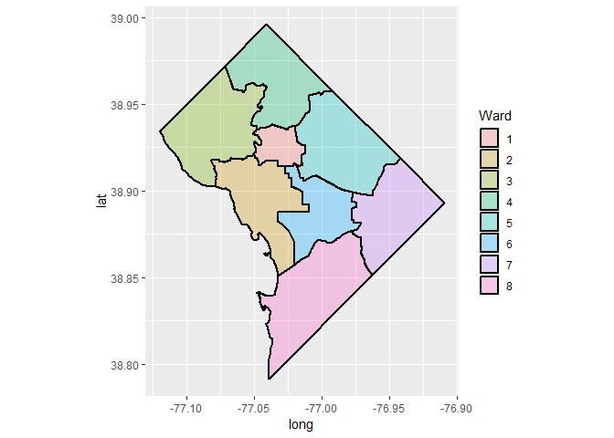
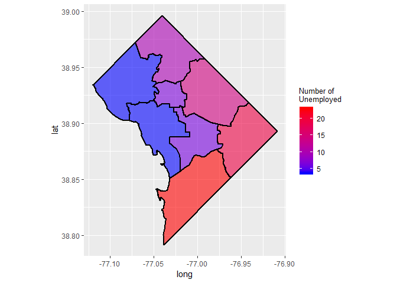
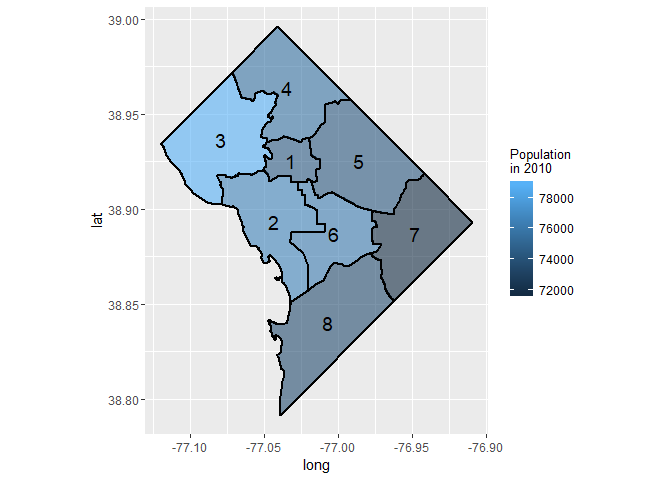
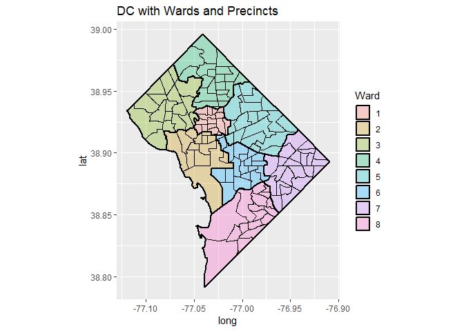
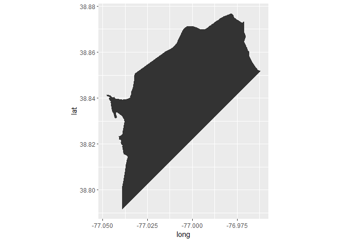
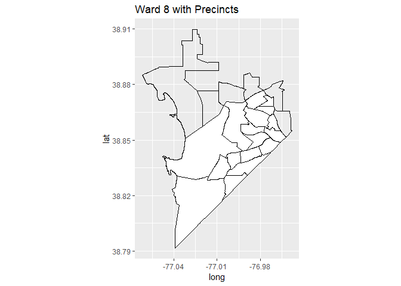

How to DCmapR
================
Edward ‘Bingo’ LaHaye
2019-04-08

## Introduction

Hi and welcome to my first package, DCmapR. This package was first
created in response to the 2nd annual hackathon at The Catholic
University of America School of Engineering. Me and my team ran into the
problem of plotting our points among the different wards and precincts
of DC, and so this package was born from that struggle. This package
will help you do a couple of things:

1.  Get the shape files for the wards and precincts in DC

2.  Get the data.frame coordinates and labels for all of the wards and
    precincts

3.  Calculate the centroids for both wards and precincts so that you can
    easily label them

4.  Create detailed and beautiful graphs of Washington, DC\!

These objectives will be accomplished through each of their own
functions that I will walk you through.

## get\_Ward

This is a pretty basic function that gives you either the shape data or
the dataframe data. To select the dataframe output just put `dataframe =
TRUE` as the argument, or you can leave it blank.

``` r
library(DCmapR)
```

    ## Loading required package: sp

    ## Welcome to DCmapR

``` r
# For example lets get the dataframe for wards
WardsDF <- get_Ward(dataframe = TRUE)
# And you can easily plot this using ggplot2
library(ggplot2)
mapOG <- ggplot() +
  geom_polygon(data = WardsDF, aes(x = long, y = lat, group = group, fill = factor(Ward)),
               col  = "black", alpha = 0.3, size = 1) + 
  scale_fill_discrete(name = "Ward") + 
  coord_quickmap()
mapOG
```

<!-- -->

And if you want to you can use the shape file in the same way for
plotting, or you can also extract the data from it using `data.frame` on
it. You can plot the SF as well it just can be a bit difficult in the
naming conventions, so i recommend sticking with the dataframe.

``` r
WardsSF <- get_Ward(dataframe = FALSE)
WardsSFData <- data.frame(WardsSF)
# but you can combine this for some nice maps :)
library(dplyr)
biggerset <- WardsDF %>%
  full_join(WardsSFData, by = c("Ward" = "WARD"))
#You can then use this to make a nice little cloropleth map
plot1 <- ggplot() +
  geom_polygon(data = biggerset, aes(x = long, y = lat, group = group, 
               fill = as.numeric(as.character(POP_2010))), 
               col  = "black", alpha = 0.6, size = 1) +
  scale_fill_continuous(name = "Population \nin 2010") +
  theme(legend.title = element_text(size = 10)) + 
  coord_quickmap()
plot2 <- ggplot() +
  geom_polygon(data = biggerset %>% group_by(Ward), aes(x = long, y = lat, group = group, 
               fill = as.numeric(as.character(UNEMPLOYME))), 
               col  = "black", alpha = 0.6, size = 1) +
  scale_fill_gradient(name = "Number of \nUnemployed", low = "blue", high = "red") +
  theme(legend.title = element_text(size = 10)) +
  coord_quickmap() 
plot1
plot2
```



Now as you can see from this, we can make nice looking graphs but we
need labels for them\! And my solution comes with the next function:
get\_centroid

## get\_centroid

get\_centroid came about to help with labeling and getting those labels
into a pleasing spot for the wards. I wanted to get into the center for
each shape so I used `gCentroid` from `rgeos` to get them. You can get
the centroids of either the Wards or Precincts depending if you select
`TRUE` or `FALSE` for one of the options. Selecting neither will get you
nothing. Now lets get these labels on there\!

``` r
Wardlabs <- get_centroid(Ward = TRUE)
# And then you just add it in!
plot1 + 
  geom_text(data = Wardlabs, aes(x, y, label = Ward), size = 5)
```

<!-- -->

``` r
plot2 + 
  geom_text(data = Wardlabs, aes(x, y, label = Ward), size = 5)
```

<!-- -->

Now there is a bit more information for the maps\! The next step is to
dive deeper into these wards and look into the precincts with in them.

## get\_Precinct

This function was designed to get a better perspective on the wards
themselves and how their parts added up to the whole of DC. You can use
this function to give more detail to the map as a whole, or filter
through to get more detail on a singular ward. `get_precinct` contains
only one parameter `dataframe = TRUE`, which you can change to false for
the shapefile.

``` r
PrecinctDF <- get_Precinct(dataframe = TRUE)
#Take the first map we made and layer onto it
mapOG + 
  geom_polygon(data = PrecinctDF, aes(x = long, y = lat, group = group), inherit.aes = FALSE, fill = NA, colour = 'black')
```

<!-- -->

This map is looking great, now lets zoom into Ward 8.

``` r
#Trim to ward 8, I'm not sure why its polygon number is 1
PrecinctSF <- get_Precinct(dataframe = FALSE)
Ward1SF <- WardsSF[1,]
Just1 <- PrecinctSF[Ward1SF, ]
ggplot() + 
  geom_polygon(data = Ward1SF, aes(x = long, y =  lat, group = group)) + 
  coord_quickmap()
```

<!-- -->

``` r
#Use over to get the overlapping datapoints
PrecinctSF <- get_Precinct(dataframe = FALSE)
ggplot() + 
  geom_polygon(data = Ward1SF, aes(x = long, y =  lat, group = group), fill = "white") + 
  geom_polygon(data = Just1, aes(x= long, y = lat, group = group), fill = NA, col = "black") +
  coord_quickmap() + 
  ggtitle("Ward 8 with Precincts")
```

<!-- -->

Refining the method of defining which precincts are in each ward will be
in the next version of DCmapR. As you can see it gets pretty close, and
with some tweaking could turn into a nice chloropleth map.

## Conclusion

Overall I hope you enjoy using this package as I enjoyed developing it.
All info was acquired from ([via](http://opendata.dc.gov/)), so go get
exploring that data as well if you are interested.
